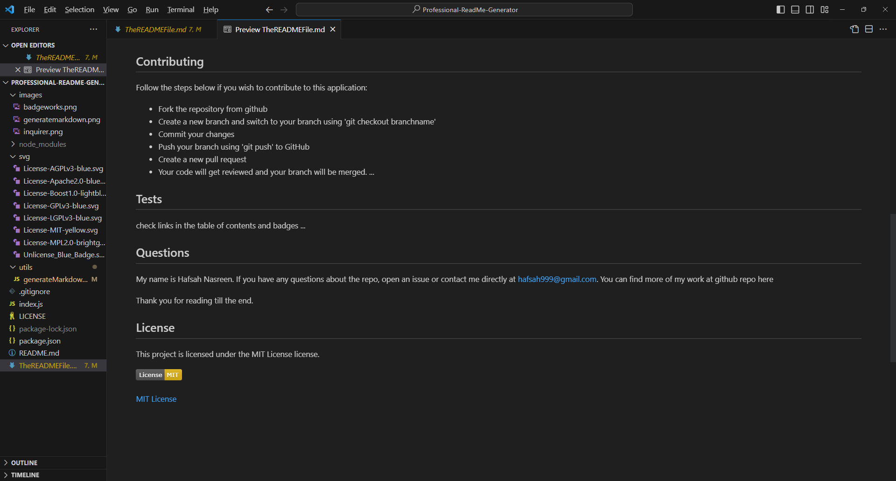

# Professional README Generator

...

## Table of Contents

- [Description](#description)
- [User Story](#user-story)
- [Acceptance Criteria](#acceptance-criteria)
- [Walkthrough](#walkthrough)
- [Installation](#installation)
- [Usage](#usage)
- [Credits](#credits)
- [License](#license)

...

## Description

This is the first javascript backend environment project. In this project, we created a markdown function that uses a series of prompts to generate a readme file.

## User Story

AS A developer
I WANT a README generator
SO THAT I can quickly create a professional README for a new project

## Acceptance Criteria

GIVEN a command-line application that accepts user input

WHEN I am prompted for information about my application repository
THEN a high-quality, professional README.md is generated with the title of my project and sections entitled Description, Table of Contents, Installation, Usage, License, Contributing, Tests, and Questions

WHEN I enter my project title
THEN this is displayed as the title of the README

WHEN I enter a description, installation instructions, usage information, contribution guidelines, and test instructions
THEN this information is added to the sections of the README entitled Description, Installation, Usage, Contributing, and Tests

WHEN I choose a license for my application from a list of options
THEN a badge for that license is added near the top of the README and a notice is added to the section of the README entitled License that explains which license the application is covered under

WHEN I enter my GitHub username
THEN this is added to the section of the README entitled Questions, with a link to my GitHub profile

WHEN I enter my email address
THEN this is added to the section of the README entitled Questions, with instructions on how to reach me with additional questions

WHEN I click on the links in the Table of Contents
THEN I am taken to the corresponding section of the README

## Walkthrough

[Video Walkthrough of the project](https://app.screencastify.com/manage/videos/LlmCqC6ttxXGN2r6etfw)

[The Readme.md generated using terminal](TheREADMEFile.md)

## Installation

The application runs on the command line prompt. In order to invoke the application, you will first need to install [NodeJs 16LTS](https://nodejs.org/ja/blog/release/v16.16.0)

Once you are done installing the backend run environment mentioned above, make sure you remember the project folder, and use cd .. or cd foldername to be the same folder as the application. Finally, use the command node index.js to run the application and answer the series of prompts according to your project needs.

## Usage

### Inquirer Package

### Creating a sample

### Viewing the license badge

## Credits

[How to create a Professional README](https://coding-boot-camp.github.io/full-stack/github/professional-readme-guide)

[Inquirer](https://www.npmjs.com/package/inquirer/v/8.2.4)

[Upload Screenshot](https://www.w3schools.com/nodejs/nodejs_uploadfiles.asp)

[Licenses](https://choosealicense.com/licenses/)

## License

[Read Here](https://opensource.org/license/mit/)
